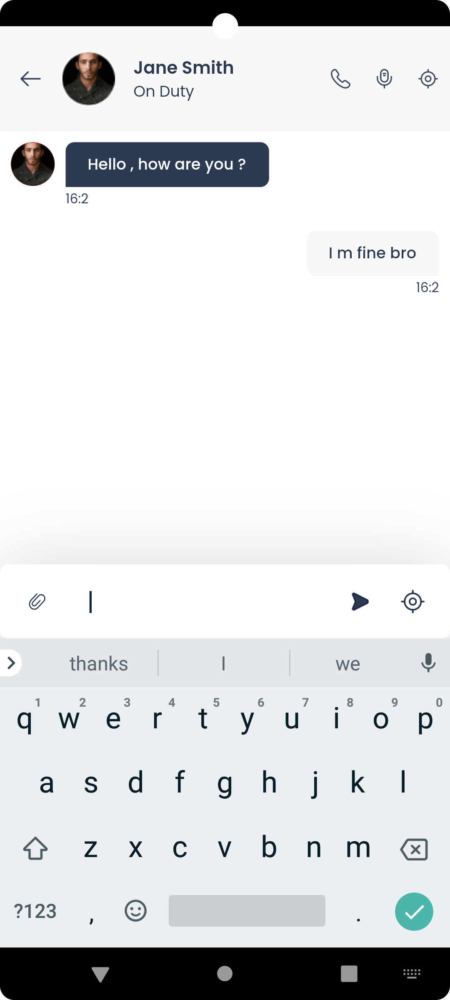

# Team On The Run - TOTR

## Overview

This project was developed during my internship at [**ZetaBox**](https://zeta-box.com), where I contributed to the **frontend development** of a dynamic chat mobile application **TOTR** focusing on creating a user-friendly interface with advanced design principles and efficient state management using **Flutter** and **Riverpod**.

## Description

The application aims to provide a dynamic and customizable chat experience for organizations. It is designed to allow super administrators to tailor aspects such as the app's name, logo, theme ... thanks to the generator (builder). This feature-rich application enhances group communication through advanced functionalities like discussion channels and a Push-to-Talk mode, catering to the dynamic needs of modern enterprises.

## Key Features
- **Customizable Themes**: Organizations can define their name, logo, and theme for a personalized experience.
- **Secure Authentication**: Facilitates secure user login with organization ID, phone number, and SMS verification.
- **Group Communication**: Offers group chat channels and private messaging.
- **Contact Management**: Users can manage their contact lists, including favorites and profile views.
- **Status Management**: Allows users to set and view statuses in real-time.

## Tools and Technologies

## Current Status
My involvement in the project was focused exclusively on the frontend development. During this phase, I collaborated with the design team to ensure a seamless and intuitive user experience, aligning with the project's vision for a customizable and efficient communication platform.

The next major phase of development includes:
- **Completing the Frontend**
- **Developing the Generator**
- **API Integration**

## Screenshots

The following screenshots provide a visual overview of the TOTR mobile application :

### Login and Authentication :

  
  
  
  
  

### Home and Contacts :

  
  
  
  
  
  
  
  

### Chat and Channels :

  
  
  
  
  

